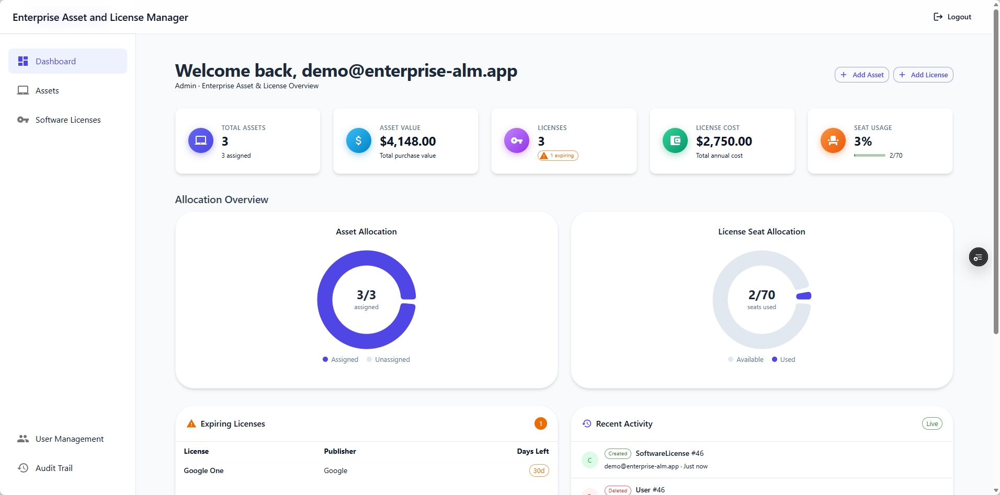
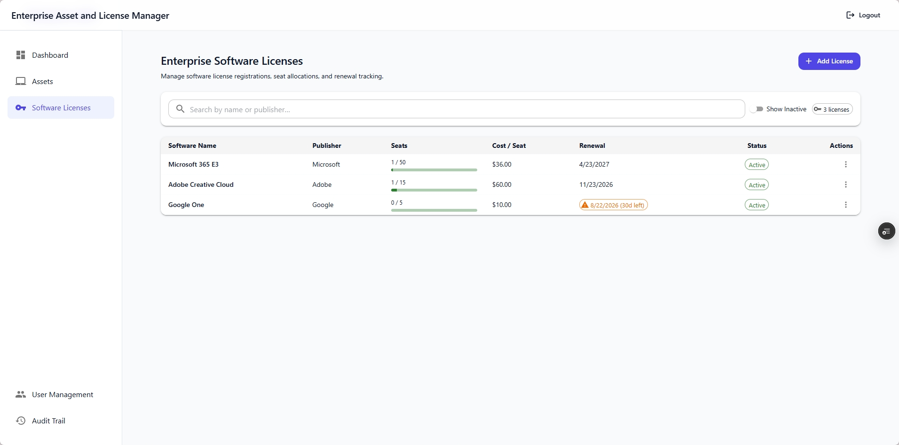
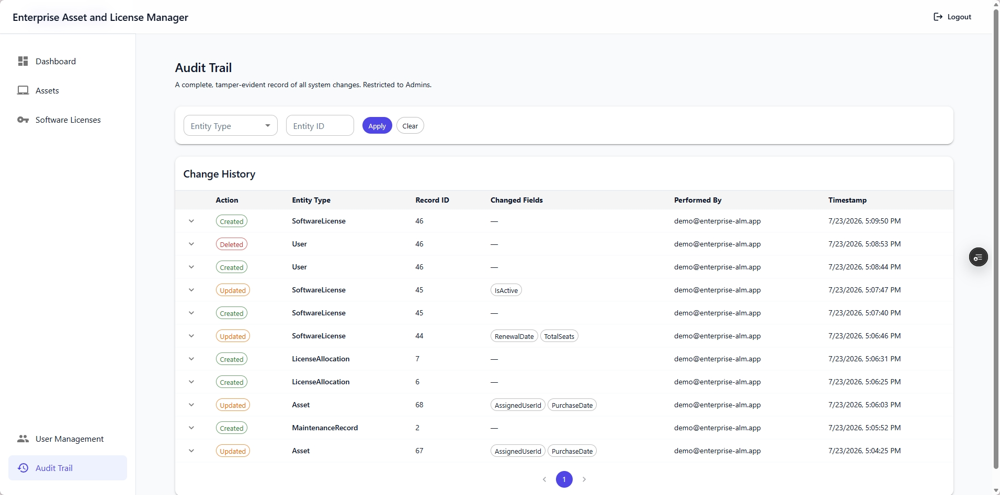

# Enterprise Asset & License Manager (ALM)

A full-stack platform for tracking organizational hardware assets and SaaS software licenses — built with **.NET 8** on a Clean Architecture foundation and a **React 19 + TypeScript** front end.

It handles the full asset lifecycle (procurement → maintenance → depreciation → retirement), SaaS license seat allocation, role-based access control, and an automatic audit trail of every change.

> **Status:** Core feature set complete and running locally. Actively extending — see the [Roadmap](#-roadmap).

<!-- Live demo: _coming soon_ -->

## 📸 Screenshots

<!--
  Save images to docs/screenshots/ and uncomment the lines below.
  Suggested captures: dashboard, asset detail w/ depreciation, license seat allocation, audit log.
-->
<!--  -->
<!--  -->
<!--  -->
<!--  -->

## ✨ Features

### 💻 Hardware Asset Lifecycle
- Full CRUD over physical assets (laptops, desktops, servers) with serial-number tracking.
- **Maintenance history** — log dated service records with cost against any asset.
- **Straight-line depreciation** — current book value computed from purchase price, expected lifespan, and salvage value.
- Assign and reassign assets to individual employees.

### 🔑 SaaS License Management
- Track software licenses with total seat counts and renewal dates.
- **Seat allocation** — allocate and release individual seats per user, with capacity enforcement.
- **Soft deletes** — deactivated licenses are retained for historical reporting rather than destroyed.

### 🛡️ Role-Based Access Control
Three seeded roles, enforced per-endpoint with framework-native `[Authorize(Roles = ...)]` attributes:

| Role | Access |
| --- | --- |
| **Admin** | Full system authorization and rule control |
| **Manager** | Read/write assets, licenses, and seats |
| **Viewer** | Read-only access to monitoring dashboards |

Authentication is JWT bearer-based, with passwords hashed using BCrypt.

### 📜 Audit Trail
Entity changes are captured automatically via the EF Core `ChangeTracker` — recording old values, new values, the specific columns that changed, the acting user, and a UTC timestamp. Exposed to Admins through a filterable, paginated view.

### 📊 Dashboard
Real-time inventory summary with a recent-activity feed sourced from the audit log.

### ⏱️ Background Processing
`LicenseExpirationJob` runs as a long-lived `BackgroundService` on a 24-hour interval, automatically deactivating any active license whose renewal date has passed. It resolves a scoped `DbContext` per run and logs failures without tearing down the host.

## 🏛️ Architecture

The backend follows **Clean Architecture** across four projects. Dependencies point inward — `Domain` has no project references, and `Application` defines the repository *interfaces* that `Infrastructure` implements, so business logic never depends on data access.

```
   Api  ────►  Application  ◄────  Infrastructure
                    │                     │
                    └──────► Domain ◄─────┘
```

| Project | Responsibility |
| --- | --- |
| `Enterprise.ALM.Domain` | Entities and business models. No dependencies. |
| `Enterprise.ALM.Application` | Services, DTOs, and repository interfaces. Holds business logic such as depreciation calculation. |
| `Enterprise.ALM.Infrastructure` | EF Core `DbContext`, repository implementations, migrations, background jobs. |
| `Enterprise.ALM.Api` | Controllers, JWT/CORS configuration, dependency injection composition root. |

Additional patterns: repository pattern over EF Core, a DTO boundary so entities are never exposed directly over HTTP, and **14 EF Core migrations** tracking schema evolution from initial creation through the audit-log addition.

The repo is a **pnpm workspace** orchestrated by **Turborepo**, with the .NET solution under `apps/backend` and the React app under `apps/frontend`.

## 🚀 Tech Stack

### Backend
- **.NET 8** (ASP.NET Core Web API), C#
- **Entity Framework Core 8** with SQL Server 2022
- **JWT Bearer Authentication** 8.0.0 + **BCrypt.Net-Next** 4.2.0
- **Swashbuckle** 6.4.0 (Swagger / OpenAPI)

### Frontend
- **React 19.2** + **TypeScript 6**
- **Material-UI (MUI) 9** with a custom theme
- **Recharts 3.9** for data visualization
- **React Router 7.18**, **jwt-decode 4**
- **Vite 8**

### Tooling
- **pnpm 11** workspaces, **Turborepo 2**, **Docker Compose**, Node.js 18+

## 📦 Getting Started

### Prerequisites
- [.NET 8 SDK](https://dotnet.microsoft.com/download)
- [Node.js](https://nodejs.org/) 18+ and [pnpm](https://pnpm.io/) 11+
- [Docker](https://www.docker.com/) (for the SQL Server instance)
- EF Core CLI tools: `dotnet tool install --global dotnet-ef`

### 1. Start the database

```bash
docker compose up -d
```

This starts SQL Server 2022 on port `1433`, with data persisted to a named volume.

### 2. Configure secrets

`appsettings.json` ships with placeholder values. Supply real ones via .NET user secrets so nothing sensitive is committed:

```bash
cd apps/backend/Enterprise.ALM.Api

dotnet user-secrets init
dotnet user-secrets set "JwtSettings:SecretKey" "<a-random-string-of-at-least-32-characters>"
dotnet user-secrets set "ConnectionStrings:DefaultConnection" \
  "Server=localhost,1433;Database=EnterpriseALM;User Id=sa;Password=<your-docker-sa-password>;TrustServerCertificate=True;"
```

> The JWT signing key **must be at least 32 bytes** — HMAC-SHA256 will throw at startup with anything shorter.

### 3. Apply migrations

Migrations live in `Infrastructure` while the host is `Api`, so both projects are specified:

```bash
cd apps/backend
dotnet ef database update \
  --project Enterprise.ALM.Infrastructure \
  --startup-project Enterprise.ALM.Api
```

### 4. Run the API

```bash
cd apps/backend
dotnet run --project Enterprise.ALM.Api
```

The API listens on `http://localhost:5132` (HTTPS on `https://localhost:7145`) and opens **Swagger UI** in your browser.

### 5. Run the frontend

```bash
cd apps/frontend
pnpm install
pnpm dev
```

The app is served at `http://localhost:5173` — the only origin permitted by the API's CORS policy.

### 6. Create your first Admin account

A fresh database is seeded with **roles but no users**, and self-registration always creates a **Viewer** (the lowest-privilege role). To reach Admin-only areas such as User Management and the Audit Log, promote your account directly in the database after registering:

```sql
UPDATE Users SET RoleId = 1 WHERE Email = 'your.email@example.com';
-- RoleId: 1 = Admin, 2 = Manager, 3 = Viewer
```

Log out and back in afterwards so the new role is embedded in a freshly issued JWT.

> This manual step is deliberate — open self-registration into a privileged role would be an obvious security hole. Provisioning real Admins is an existing-Admin operation via `POST /api/users`; this bootstrap only exists to create the very first one.

## 🔌 API Overview

All endpoints are prefixed with `/api` and require authentication unless noted. Full request/response schemas are available in Swagger while the API is running.

| Controller | Endpoints | Required Role |
| --- | --- | --- |
| **Auth** | `POST /auth/register`, `POST /auth/login` | Anonymous |
| **Assets** | `GET /assets`, `GET /assets/{id}` | Admin, Manager, Viewer |
| | `POST /assets`, `PUT /assets/{id}`, `POST /assets/{id}/maintenance` | Admin, Manager |
| | `DELETE /assets/{id}` | Admin |
| **Licenses** | `GET /licenses` | Admin, Manager, Viewer |
| | `POST /licenses`, `PUT /licenses/{id}`, `DELETE /licenses/{id}` | Admin, Manager |
| | `POST /licenses/{id}/allocate`, `DELETE /licenses/{id}/allocate/{userId}` | Admin, Manager |
| **Dashboard** | `GET /dashboard/summary` | Admin, Manager, Viewer |
| **Users** | `GET /users`, `POST /users`, `PUT /users/{id}`, `DELETE /users/{id}` | Admin |
| **AuditLogs** | `GET /auditlogs` (filter by entity, paginated) | Admin |

## 🗺️ Roadmap

- [ ] **Unit test suite** — xUnit + Moq covering `AuthService`, depreciation calculation, and seat-allocation limits
- [ ] **CI pipeline** — GitHub Actions running build, test, and lint on every push
- [ ] **Deployment** — containerize the API and publish a live demo (Azure App Service + Azure SQL)
- [ ] **Centralized API client** — replace per-page `fetch` calls and hardcoded URLs with a single typed wrapper driven by environment variables
- [ ] **Refresh-token rotation** — currently a single 120-minute access token
- [ ] **Component decomposition** — extract data hooks and presentational components out of the larger page files
- [ ] **Server-side validation** — FluentValidation on request DTOs and a global exception-handling middleware

## 👨‍💻 About The Author

Built by **Kheymp** to demonstrate full-stack engineering across a realistic enterprise domain — with an emphasis on layered backend design, security fundamentals, and maintainable data modeling.
